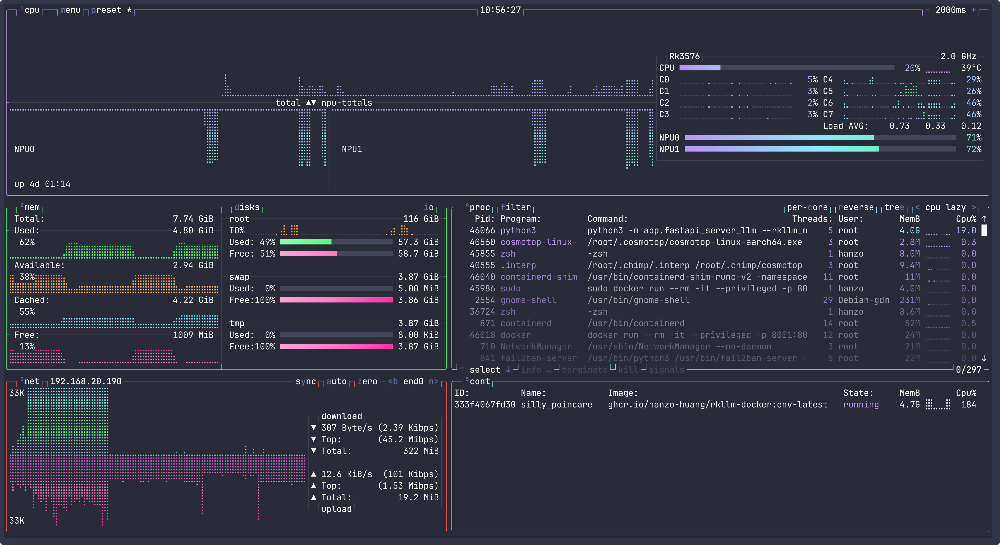

I've been using [btop](https://github.com/aristocratos/btop) for system monitoring for a long time. It's an excellent terminal-based resource monitor for tracking CPU, memory, disks, and processes. However, when working with Rockchip RK3576 and RK3588 platforms, one important metric was missing: NPU utilization.

While looking for an alternative, I came across [COSMOTOP](https://github.com/bjia56/cosmotop). It is a fork of btop built using Cosmopolitan Libc, extending the familiar interface with support for modern hardware and workloads. In addition to monitoring CPU, memory, disks, and processes, COSMOTOP can display Rockchip NPU usage, GPU utilization, Docker container statistics, and other system information in a single terminal interface.

If you're developing or deploying AI applications on RK3576 or RK3588, COSMOTOP is a useful tool for monitoring overall system performance and ensuring your NPU workloads are running as expected.

## Installation

### 1. Download the binary

Download the v0.15.2 release to a directory in your `PATH`, such as `/usr/local/bin`:

```bash
sudo wget -O /usr/local/bin/cosmotop \
  https://github.com/bjia56/cosmotop/releases/download/v0.15.2/cosmotop
```

### 2. Make it executable

```bash
sudo chmod +x /usr/local/bin/cosmotop
```

### 3. Run COSMOTOP

For standard system monitoring:

```bash
cosmotop
```

To enable Rockchip NPU monitoring, run it with root privileges:

```bash
sudo cosmotop
```



That's it! You now have a lightweight yet powerful terminal monitor capable of displaying CPU, memory, GPU, Docker, and Rockchip NPU utilization in real time.
